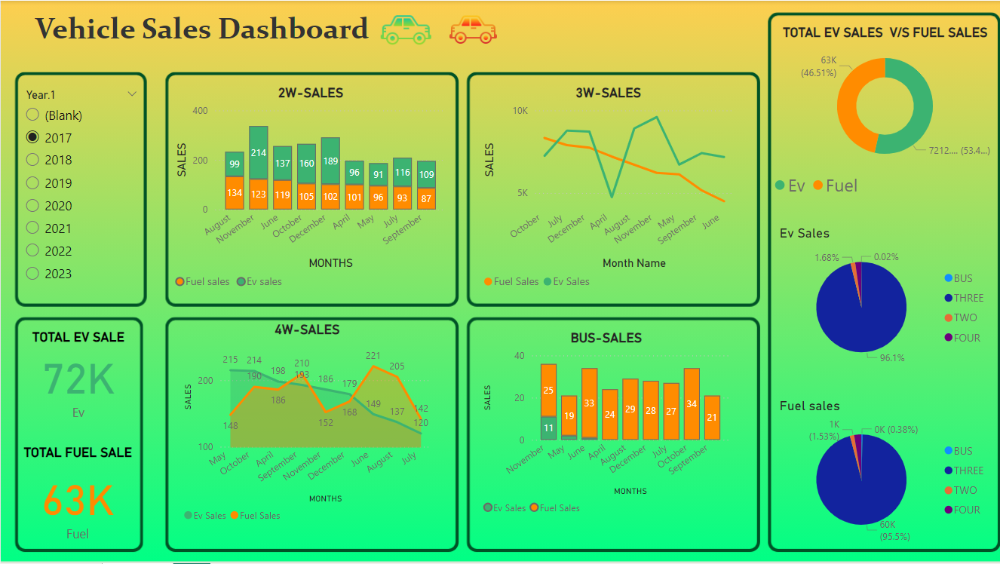

# 🚗 Vehicle Sales Dashboard

An interactive Power BI dashboard for analyzing vehicle sales performance across different vehicle categories, comparing Electric Vehicle (EV) vs Fuel-based sales trends over multiple years.

---

## 📊 Dashboard Overview

The **Vehicle Sales Dashboard** provides a comprehensive view of vehicle sales data, enabling stakeholders to monitor and compare EV and fuel vehicle performance across different segments and time periods.



---

## ✨ Features

- **Year Filter** — Slice data by year (2017–2023) for focused analysis
- **KPI Cards** — At-a-glance totals for EV Sales (72K) and Fuel Sales (63K)
- **2W-Sales Chart** — Monthly bar chart comparing 2-wheeler EV vs Fuel sales
- **3W-Sales Chart** — Line chart tracking 3-wheeler EV vs Fuel sales trends
- **4W-Sales Chart** — Area/line chart showing 4-wheeler monthly sales patterns
- **Bus-Sales Chart** — Bar chart displaying bus segment EV vs Fuel breakdown
- **EV vs Fuel Donut Chart** — High-level split between total EV and Fuel sales
- **EV Sales Pie Chart** — Category-wise breakdown (Bus, 3W, 2W, 4W) within EV
- **Fuel Sales Pie Chart** — Category-wise breakdown within Fuel segment

---

## 🗂️ Repository Structure

```
PowerBi-Dashboard-/
│
├── Vehicle sales Dashboard.pbix   # Main Power BI dashboard file
└── README.md                       # Project documentation
```

---

## 🚀 Getting Started

### Prerequisites

- [Microsoft Power BI Desktop](https://powerbi.microsoft.com/desktop/) (free download)

### Installation & Usage

1. **Clone the repository**
   ```bash
   git clone https://github.com/KrishAgarwal-44/PowerBi-Dashboard-.git
   ```

2. **Open the dashboard**
   - Launch Power BI Desktop
   - Go to **File → Open report**
   - Navigate to and select `Vehicle sales Dashboard.pbix`

3. **Explore the dashboard**
   - Use the **Year filter** on the left panel to select a specific year (2017–2023)
   - Hover over charts for detailed tooltips
   - Click on chart segments to cross-filter other visuals

---

## 📈 Key Insights

| Metric | Value |
|---|---|
| Total EV Sales | 72,000 units |
| Total Fuel Sales | 63,000 units |
| EV Market Share | ~53.49% |
| Fuel Market Share | ~46.51% |
| Top EV Segment | 2-Wheeler (~96.1% of EV sales) |
| Top Fuel Segment | 4-Wheeler (~95.5% of Fuel sales) |

---

## 🛠️ Tools & Technologies

- **Power BI Desktop** — Data modeling, DAX, and visualization
- **DAX (Data Analysis Expressions)** — Calculated measures and KPIs
- **Power Query (M Language)** — Data transformation and cleaning

---

## 📌 Vehicle Categories

| Code | Category |
|---|---|
| 2W | Two-Wheelers (bikes, scooters) |
| 3W | Three-Wheelers (auto-rickshaws, e-rickshaws) |
| 4W | Four-Wheelers (cars, SUVs) |
| BUS | Buses and commercial transport |

---

## 🤝 Contributing

Contributions are welcome! To contribute:

1. Fork the repository
2. Create a new branch (`git checkout -b feature/your-feature`)
3. Commit your changes (`git commit -m 'Add some feature'`)
4. Push to the branch (`git push origin feature/your-feature`)
5. Open a Pull Request

---

## 👤 Author

**Krish Agarwal**
- GitHub: [@KrishAgarwal-44](https://github.com/KrishAgarwal-44)

---

## 📄 License

This project is open source and available under the [MIT License](LICENSE).
